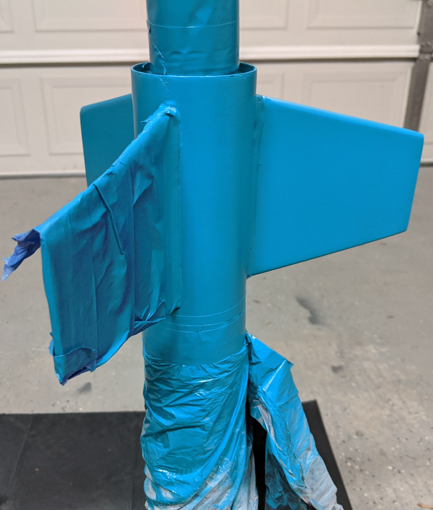

## The Motor Mount

The Hi-Tech doesn't come with motor retention, so let's add some! I went with an Aero Pack retainer which has a
ring that attaches to the bottom of the motor mount. A cap is then threaded over this once the motor has been
inserted to keep the motor from popping out on ejection.

The Aero Pack retainer's instructions suggest cleaning the grooved inside of the retaining ring (the part that slides
over the motor mount) with acetone, so do that first. Then rough up the motor mount tube with some sandpaper. This'll
help the epoxy bond stronger.

As you can see from the pic, I've also already epoxied one of the centering rings just below the retainer ring.

Once this is set, time to epoxy the other centering ring to the other end of the motor mount.

After both of these have had some time to dry, time to flip the motor mount and add epoxy to the other side of
the rings. We can also go ahead and put the eye bolt in and add a dab of epoxy to the threads to make sure it
stays secure.

Go ahead and attach the shock cord to the eye bolt using a quick link. Note this is different than the instructions
which have you epoxy a small piece of string inside the body tube for attaching the shock cord to. Attaching the shock
cord to the motor mount directly will give the recovery harness more strength and less likely to pull out at a critical
moment.

Now spread some epoxy around the body tube just past the fin slots. Make sure no epoxy
gets into the fin slots. Then thread the shock cord through the body tube and insert the motor mount. The stock
directions instruct you to place the rocket on its end, but we can't do that due to the motor retainer (it would push
the motor mount in too far, interferring with the fin slots). Instead lay the rocket on its side while the epoxy sets up.

Once the epoxy sets, stuff the shock cord into the upper part of the body and turn the motor mount up. Pour some epoxy
in the joint between the centering ring and body tube. Make sure to wipe off any epoxy that gets onto the motor retainer.
Leave the body tube standing upright while the epoxy finishes setting. Let this assembly dry overnight.

 

## The Fins

### Prep

Patience is the key to getting silky looking fins. Don't rush this step.

Start by sanding the edge of a fin into a round shape. This will be the leading edge.

Then sand the other edge of a fin into a V-shape. This'll be the trailing edge.

Do the same for the other two fins.

Now it's time to fill the fins. If you paint wood fins without filling, you'll see
wood grain in the paint. To get rid of this, take some wood filler, mix with a small
bit of water to make the consistency thinner, then spread over the fins. There's a
balance to be had. Too much filler and it'll take longer to sand off. Too little
and the painted fin won't be as smooth.

If you have some left over filler after filling the fins, you can start filling the body tube
seams as well. I was a little heavy with the filler on the payload tube. I should've used
a smaller stick to apply. 

Once the filler finishes drying, it's time to sand. I started with 100 grit sandpaper
to take the majority of the filler off, then started working my way to finer grits.
150, 220, 400, 800. When done you're left with a silky smooth fin that'll paint great.

Time to fill the main body tube and nose cone. The nose cone seam may need trimming with a hobby knife.

### Attach

Now that everything has been prepped it's time to actually attach the fins! For these I did have to trim
a bit out of the fin slots in the body tube with a hobby knife to get the fins to fit nicely. Once the fit
is good, apply some epoxy to the root edge of a fin and stick it in a slot. Sight down the body tube and fin
and try to get the fin as perpendicular to the body tube as possible. I then like to put a piece of tape over
the fin to hold it in place while drying. 

After allowing time for the epoxy to set, repeat for the other two fins.

Now that all 3 fins are attached, we need to apply epoxy fillets between each fin and the body tube. This'll
give us a very strong fin connection. I take some tape and place at each fin edge then mix some epoxy and slowly
pour into the grove between the fin and body tube. You can do two joints at a time. Tilt the rocket to get the
epoxy to run both to the very forward and very aft parts of the joint, then set level to dry. Repeat for the
remaining joints.

Now would be a good time to attach the launch lugs, or rail guides in my case. I picked up some conformal
rail guides to replace the launch lugs that come with the kit. Sight a high point between two fins, then mark
the body tube 8" from the bottom. The first guide will go here. The second guide place ~6" above the first.
Sight down the tube to make sure the guides are in alignment. Would hate for this to not fit on the launch
equipment!

If you're sticking with launch lugs, once the initial placement is dry, add an epoxy fillet to the lugs.

## Painting

Now with everything mostly assembled, it's time to paint! First, sand everything down with 400 then 800 grit
sandpaper. Then use a tack cloth (can be found in the paint section of Home Depot or Lowes) to wipe everything
down. This'll get rid of nearly all the dust, giving you a good clean surface to apply the primer. Begin by 
applying a primer coat, lightly coating the rocket. Don't go too heavy with the primer. Instead do a couple
light coats about 10 minutes apart. Once the rocket is well covered with the primer, leave to dry for 24 hours.

Here's a pic after my first primer coat.

Once dry, inspect the rocket for any rough spots. They'll stick out like a sore thumb. Sand anything that needs
it down with 400 then 800 grit again until everything is smooth. Then apply a couple more light coats 10 minutes
apart. Let dry again for 24 hours. Sand everything lightly with 800 grit sandpaper and wipe down with a tack
cloth again.

Now to get to the actual color of the rocket. Take the same approach as the primer coat, doing a couple light
coats 10 minutes apart then letting dry for 24 hours. Sand lightly with 800 grit sandpaper if necessary,
but don't forget to hit with the tack cloth again if you do. Apply another couple of light coats if necessary. 

Before masking I like to be overly cautious and let everything dry for 48 hours before applying tape. Just to
be safe. I hate paint coming off with the tape.

Once it's had a chance to dry, tape it up to paint any other colors. Here I've used a plastic bag to cover the
body tube and tape to tape up one fin.

After giving all of that at least 24 hours to try, gently pull off the tape.

Finished rocket!

Soon to come - a launch report!
